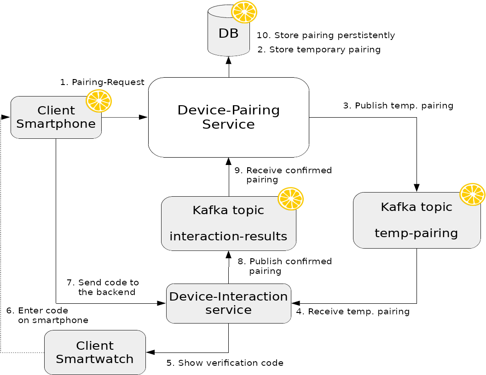

# smartwatch-mapping-service
A sample Microservice with BDD and Citrus integration tests using Apache Kafka.

# System architecture overview

# Scope of this project
As the system architecture overview shows, we've a lot of system involved. Nevertheless the testing scope of this
project is limited to the integrations of the Device-Pairing Service. Therefore, we'll just simulate the surrounding
Systems of our system under test using Citrus. The other services of the architecture are not represented here. 
